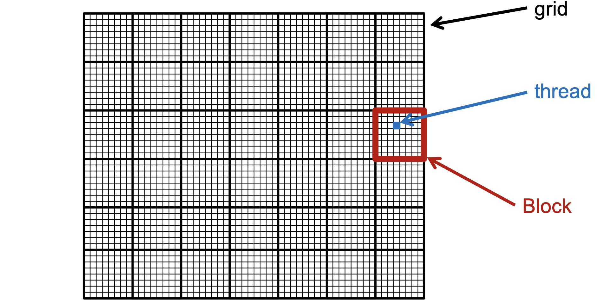
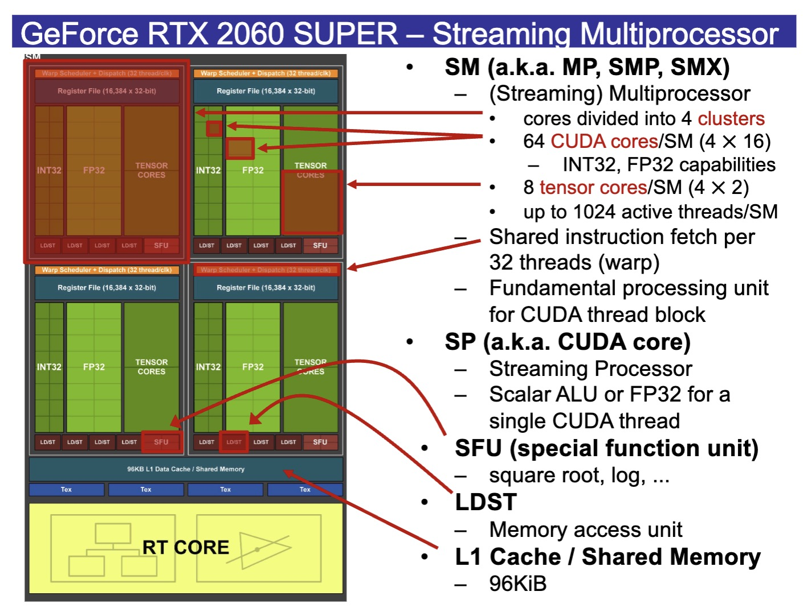
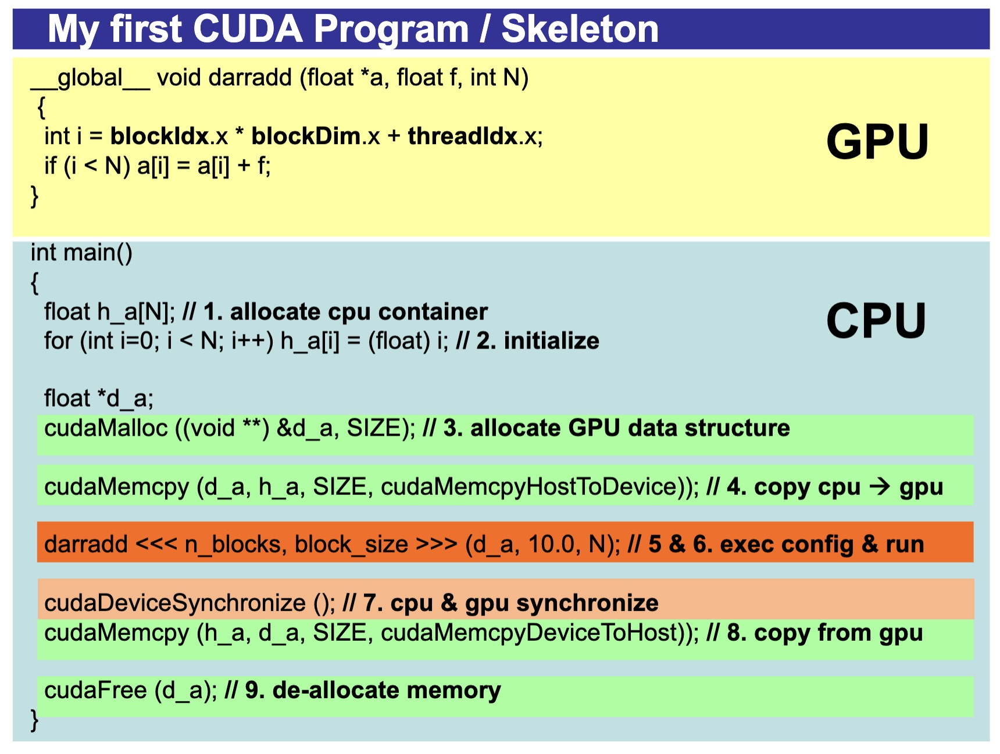
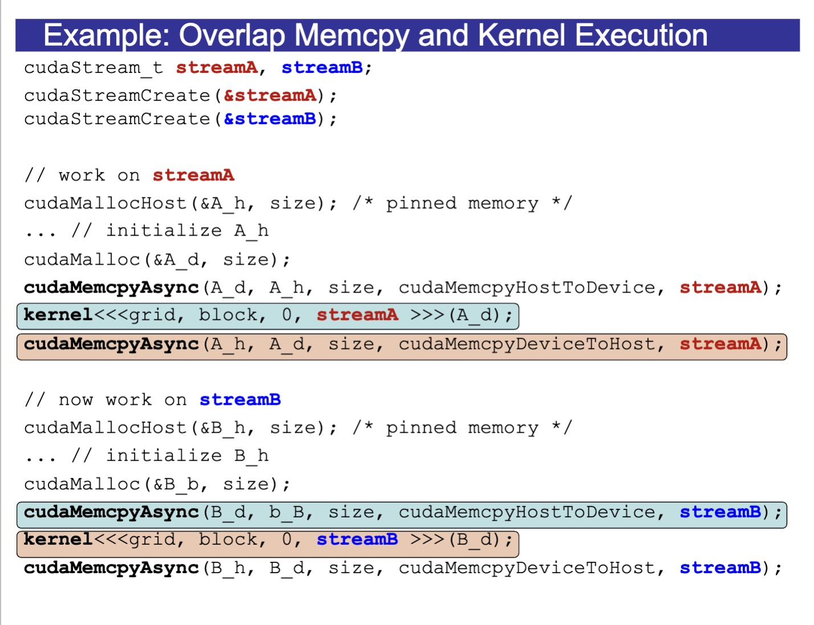
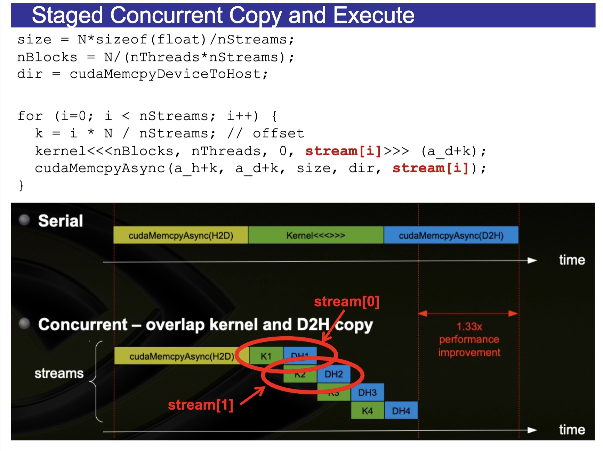
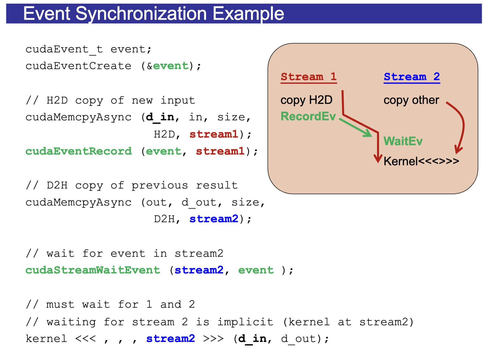

# Fundamentals of CUDA Programming

---

## The GPU Philosophy: Bandwidth over Latency

Think of a CPU as a Ferrari: it gets one or two people to a destination incredibly fast. A GPU is a massive fleet of buses: each bus is slower than the Ferrari, but together they can move an entire city's population at once.

---

## The Hierarchy of Computation

To manage these thousands of threads, CUDA organizes them into a clear hierarchy. You must memorize this structure to write any kernel:

- **Thread:** The smallest unit of work. Executes your "Kernel" function.

- **Block:** A group of threads. Threads in the same block can "talk" to each other via shared memory and synchronizing their execution.

  *Note: an example of synchronization is: let's say thread A sets x = 5, and thread B uses x. If A and B are in the same block, we could make B wait for A before using x. You can't do this between blocks.*

- **Grid:** A collection of blocks that make up a single "Kernel" launch. Blocks within a grid are independent—they cannot reliably communicate. Block execution order is undefined.



*Hardware Example:*

A **Cluster** is a new hierarchy level that groups multiple thread blocks together. Each cluster has its own **Warp Scheduler** and **Dispatch Unit**. 

**CUDA Cores** are designed for **SIMT** (Single Instruction, Multiple Threads) processing.

**Tensor Cores** are specialized for **Matrix Math**.



**Wrap:** the basic unit of execution, containing 32 threads.

*Why do we need Wrap?* Every processor needs to **Fetch** an instruction (like "Add these numbers"), **Decode** it, and then **Execute** it.  Instead of 32 threads having 32 fetchers and 32 decoders, the GPU has **one** fetcher and **one** decoder for the whole warp.

Note: In a block, the threads with the smallest global index gets executed first.

### How to determine the block size?

1. **Use multiples of 32**

2. **Filling up the SM**

   (1) Num block limit per SM

   (2) Num of threads limit per SM

3. **Consider registers and shared memory pressure**

   The number of registers and amount of shared memory on a SM is fixed. If each thread or block uses more registers or shared memory, you might allocate less threads and shared memory on your SM.

   You could check "Section: Launch Statistics" of your analysis from Nsight Compute for registers per thread and shared memory per block used.

---

## The Programmer’s Workflow

1. **Allocate** memory on the CPU.
2. **Initialize** data on the CPU.
3. **Allocate** memory on the GPU (using `cudaMalloc`).
4. **Copy** data from CPU to GPU (`cudaMemcpy` with `HostToDevice`).
5. **Define** the execution configuration (how many blocks? how many threads?).
6. **Launch** the Kernel (the `<<<...>>>` syntax).
7. **Synchronize** (wait for the GPU to finish).
8. **Copy** results back to the CPU (`DeviceToHost`).
9. **Free** memory on both sides.



*Note for step 4:*

**`cudaMemcpy()`**: This is blocking. If the data is $> 64$ KiB, the CPU waits until the transfer is finished.

**`cudaMemcpyAsync()`**: This is non-blocking. It requires **Pinned Memory** (`cudaMallocHost`), which is memory that the OS cannot "page out" to the hard drive. This allows the GPU to pull data directly while the CPU moves on to other tasks.

*Note for step 5:*

A standard kernel launch looks like this:

```C++
KernelName<<<gridDim, blockDim, sharedMem, stream>>>(param1, param2, ...);
```

Calls to a kernel function are asynchronous.

While there are four possible arguments inside the brackets, you will almost always use the first two.

### 1. `gridDim` (Blocks per Grid)

The first parameter specifies the number of **Blocks** in the grid.

### 2. `blockDim` (Threads per Block)

The second parameter specifies the number of **Threads** within each block.

### 3. `sharedMem`

Optional shared memory size (bytes).

### 4. `stream`

Optional Stream ID for concurrency.

*Note for step 7:*

The `cudaDeviceSynchronize()` function is a **blocking call** that ensures all previously issued **CUDA operations** on the current GPU device are **completed** before the host (CPU) thread continues execution. 

*Note for GPU function in the example:*

For a simple 1D array, the formula for a thread's global index $i$ is:

$$i = \text{blockIdx.x} \times \text{blockDim.x} + \text{threadIdx.x}$$

- **`blockIdx.x`**: Which block am I in?
- **`blockDim.x`**: How many threads are in each block?
- **`threadIdx.x`**: Which thread am I within my specific block?

We need `if (i < N)` because some of the blocks might not need all the threads.

For example, assume we need to calculate 5 data points. We have 2 blocks and threads/block is 4, then the last block will not use all the threads. 

---

## Streams and Concurrency

**Stream:** Sequence of operations that execute in issue-order on GPU





### Event Synchronization



### 1. The Setup (Creating the Marker)

```c++
cudaEvent_t event;
cudaEventCreate(&event);
```

Think of `event` as a **flag**.

### 2. Stream 1: Preparing New Data

```C++
cudaMemcpyAsync(d_in, in, size, H2D, stream1);
cudaEventRecord(event, stream1);
```

- **The Copy:** We tell `stream1` to start moving new input data from the CPU to the GPU.
- **The Signal:** `event` is recorded after all preceding operations (in this case, memcpy) in `stream1` have been completed.

### 3. Stream 2: Moving Old Data & Waiting

```C++
cudaMemcpyAsync(out, d_out, size, D2H, stream2);
cudaStreamWaitEvent(stream2, event);
```

- **The Parallel Task:** `stream2` starts copying a *previous* result back to the CPU. Because it's a different stream, this can happen at the exact same time as the copy in `stream1`.
- **The Wait:** Here is the crucial part. `cudaStreamWaitEvent` tells `stream2`: *"Before you execute any more commands in your queue, you must wait until event is signaled."*
- **Important Note:** This **does not** block the CPU. The CPU keeps running and submits the next command immediately. The waiting happens entirely on the GPU hardware.

### 4. The Final Execution

```
kernel <<< , , , stream2 >>> (d_in, d_out);
```

- This kernel is launched in `stream2`.
- Because of the `WaitEvent` we just issued, this kernel **cannot start** until `stream1` has finished uploading the new data (`d_in`).

### Summary of the Flow

| **Stream 1 Activity** | **Stream 2 Activity**     | **Why?**                                                 |
| --------------------- | ------------------------- | -------------------------------------------------------- |
| **Copy H2D** (Input)  | **Copy D2H** (Old Result) | They run in parallel to hide latency.                    |
| **Record Event**      |                           | Marks that Input is ready.                               |
|                       | **Wait Event**            | Stream 2 pauses its queue until Stream 1's copy is done. |
|                       | **Kernel Launch**         | Uses the Input that Stream 1 just finished moving.       |

---

## Variable Declaration

### 1. `__device__` (Global Memory)

Variables declared with `__device__` reside in **Global Memory**. .

- **Scope:** Visible to all threads across all blocks and to the host (CPU).
- **Lifetime:** Application.
- **Capacity:** Limited only by the GPU’s total VRAM (e.g., 8GB, 24GB).
- **Usage:** Used for large datasets that need to be processed by multiple kernels.
- **Performance:** Slow.
- **Allocation:** cudaMalloc()

### 2. `__constant__` (Constant Memory)

Variables declared with `__constant__` reside in a specialized, **read-only** section of device memory.

- **Scope:** Visible to all threads across all blocks; read-only for the GPU.
- **Lifetime:** Application.
- **Capacity:** Usually limited to **64 KB**.
- **Usage:** Perfect for "broadcast" data—values that every thread needs to read at the same time.
- **Performance:** Fast.
- **Allocation:** cudaMemcpyToSymbol()

### 3. `__shared__` (Shared Memory)

Variables declared with `__shared__` are located **on-chip**. This is a high-speed, programmer-managed cache that is shared **within a single thread block**.

- **Scope:** Visible only to threads **within the same block**.
- **Lifetime:** Kernel launch.
- **Capacity:** Very small (typically 48KB to 100KB per block/SM).
- **Usage:** Used for inter-thread communication (e.g., a parallel reduction sum) or to "tile" data to avoid repeated slow reads from Global Memory.
- **Performance:** Fast.

### 4. Unqualified Variables

Stored in registers (if don’t fit: global memory).


