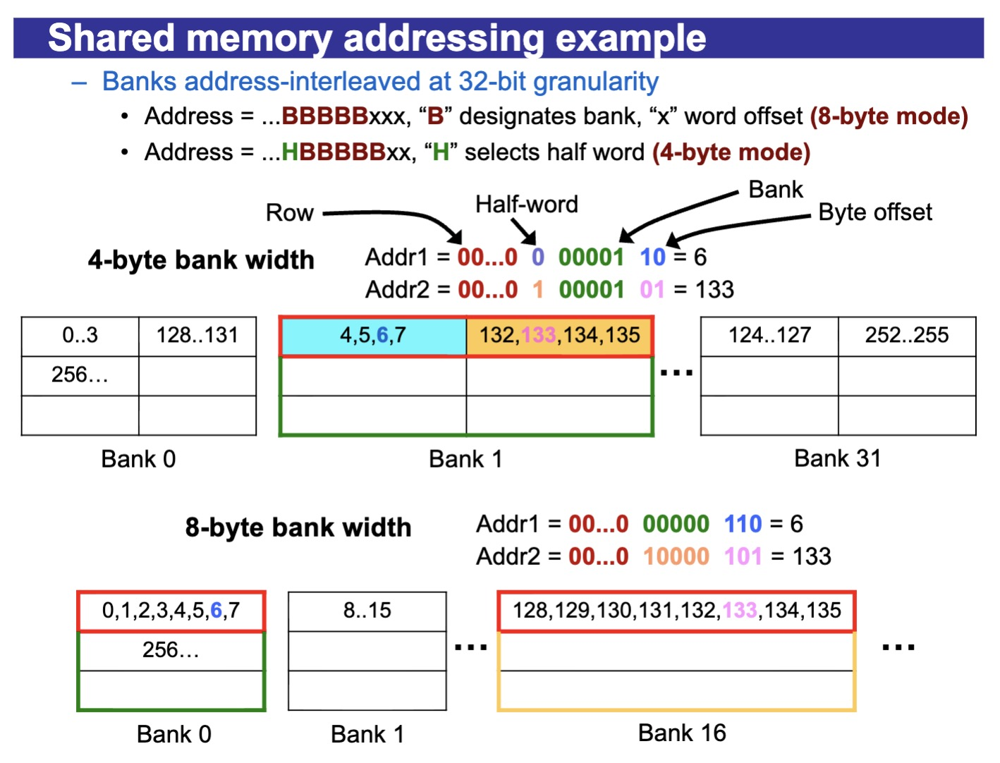
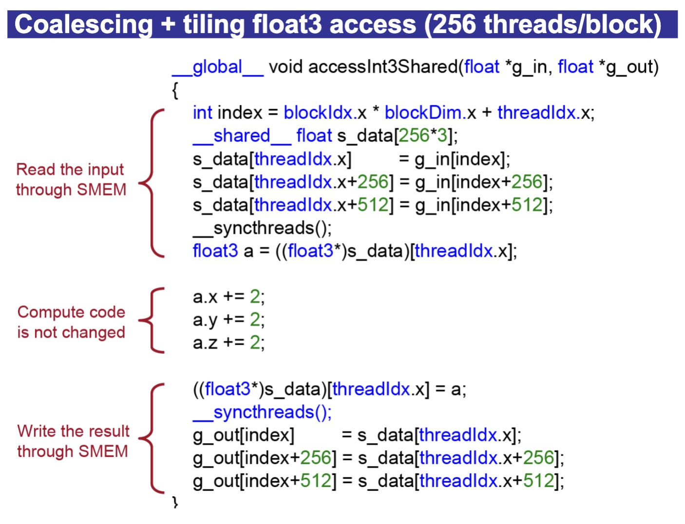
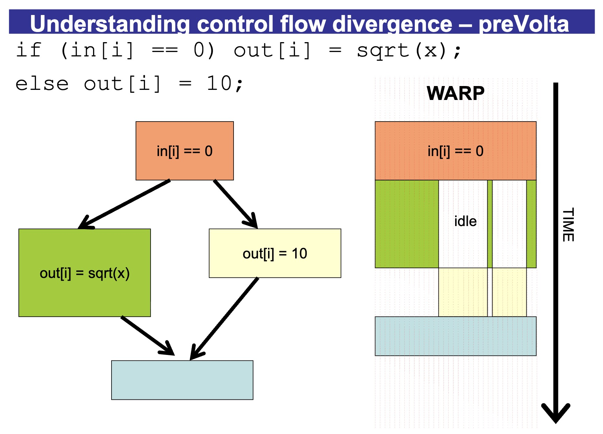

# Optimization

---

## Shared Memory Addressing

This part shows how **Shared Memory** is physically organized to allow multiple threads to access data simultaneously without crashing into each other.

### The Core Mechanics: Address Interleaving

Shared memory doesn't store data in one long line. Instead, it "interleaves" data across the 32 banks at 32-bit (4-byte) granularity.

- **Bank 0** holds bytes 0-3.
- **Bank 1** holds bytes 4-7.
- **Bank 31** holds bytes 124-127.
- **Bank 0 (next row)** then holds bytes 128-131.



### Example A: 4-Byte Bank Width

In this mode, each bank is exactly 4 bytes wide. Look at the binary addresses in the image:

- **Addr1 (Byte 6):** The bits show it belongs to **Bank 1** because it falls in the 4-7 byte range.
- **Addr2 (Byte 133):** The bits show it also belongs to **Bank 1**, but in the *second row* (bytes 132-135).

*Note: If Thread A wants Byte 6 and Thread B wants Byte 133, they are hitting the **same bank** (Bank 1). This causes a **bank conflict**, and the hardware must process them sequentially.*

### Example B: 8-Byte Bank Width

Some newer architectures allow you to configure banks to be 8 bytes wide to better support `double` precision or larger data types.

- **Addr1 (Byte 6):** Now fits into **Bank 0**, which now covers bytes 0-7.
- **Addr2 (Byte 133):** Now fits into **Bank 16**.
- **The Result:** Because they are now in different banks, these two requests can be served **simultaneously** with zero conflict.

---

## Optimization Strategy 1: Shared Memory

Move data in shared memory, and assign each thread to its own bank

*Example:*

```c++
// CUDA program to perform matrix multiplication
#define TILE_WIDTH 16

__global__ void matrixMulTiled(float* A, float* B, float* C, int width) {
  // 1, Create shared memory for tiles
  __shared__ float ds_A[TILE_WIDTH][TILE_WIDTH];
  __shared__ float ds_B[TILE_WIDTH][TILE_WIDTH];

  int bx = blockIdx.x; int by = blockIdx.y;
  int tx = threadIdx.x; int ty = threadIdx.y;

  // calculate the global index of the result
  int row = by * TILE_WIDTH + ty;
  int col = bx * TILE_WIDTH + tx;

  float p_value = 0.0;
  int num_tiles = (width + TILE_WIDTH - 1) / TILE_WIDTH;

  for (int m = 0; m < num_tiles; m++) {
    // 2, Load the data into shared memory
    // each thread will load exactly one data point
    ds_A[ty][tx] = A[row * width + (m * TILE_WIDTH + tx)];
    ds_B[ty][tx] = B[(m * TILE_WIDTH + ty) * width + col];
    __syncthreads();

    // 3, Perform calculation (partial)
    for (int k = 0; k < TILE_WIDTH; k++) {
      p_value += ds_A[ty][k] + ds_B[k][tx];
    }
    __syncthreads();

  }

  // 4, Write result to global memory
  C[row * width + col] = p_value;

}
```

*Another Example:*

Original code:


Updated code:



Why updated code is better:

1. The updated code access global memory in contiguous chunks.
2. When modifying value, we do it in shared memory, which is way faster.


---

## Optimization Strategy 2: Memory Coalescing

When 32 threads in a warp access a contiguous 128-byte block of memory, the GPU can fulfill that with a **single memory transaction**.

In practice, here is how you achieve and verify memory coalescing.

1. Ensure your global index maps directly to your array index without gaps.

   ```c++
   // Coalesced Access
   int tid = blockIdx.x * blockDim.x + threadIdx.x;
   float val = data[tid];
   
   // Non-coalesced Access (uses stride 4 in this case)
   int tid = blockIdx.x * blockDim.x + threadIdx.x * 4;
   float val = data[tid];
   ```

2. Use Structure of Arrays instead of Array of Structures

   **AoS (Bad for Coalescing):** `struct Particle { float x, y, z; } particles[N];`

   - Thread 0 reads `particles[0].x`, Thread 1 reads `particles[1].x`.
   - The addresses are separated by the size of the struct (3 floats), creating a stride.

   **SoA (Good for Coalescing):** `struct Particles { float x[N], y[N], z[N]; }`

   - Thread 0 reads `x[0]`, Thread 1 reads `x[1]`.
   - The addresses are perfectly contiguous.

---

## Optimization Strategy 3: Managing Occupancy (TLP vs. ILP)

**Thread-Level Parallelism (TLP):** If your kernel uses fewer registers per thread, you can fit more blocks on the SM. This "hides" memory latency by having more threads ready to work.

**Instruction-Level Parallelism (ILP):** Sometimes, using *more* registers per thread allows the compiler to break dependencies and execute more instructions in parallel within a single thread.

*Example:*

Assume we have a very long calculation ($1000 \times 999 \times 998 \times \dots \times 1$), but we only have a few registers to store our value. We will need to wait for the registers to be free before storing the intermediate results of the calculations.

---

## Optimization Strategy 4: Control Flow & Precision

Avoid `if/else` statements where threads in the same warp take different paths. This "divergence" forces the warp to execute both paths sequentially, idling half the threads.

*Example of why divergence is not desirable:*



Only use **Double Precision (FP64)** if absolutely necessary. On the RTX 2060, FP32 throughput is **32x faster** than FP64.
