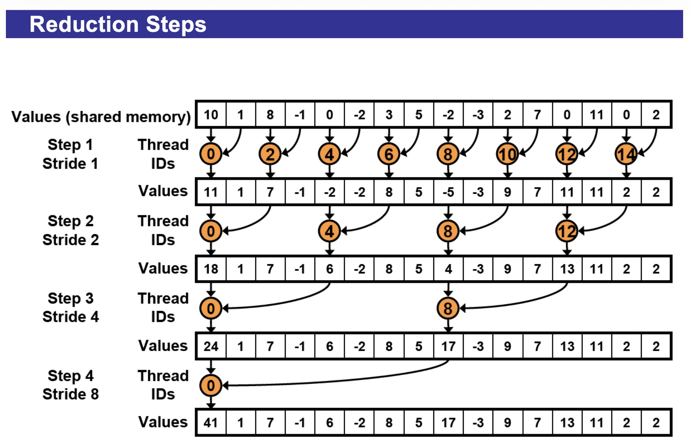
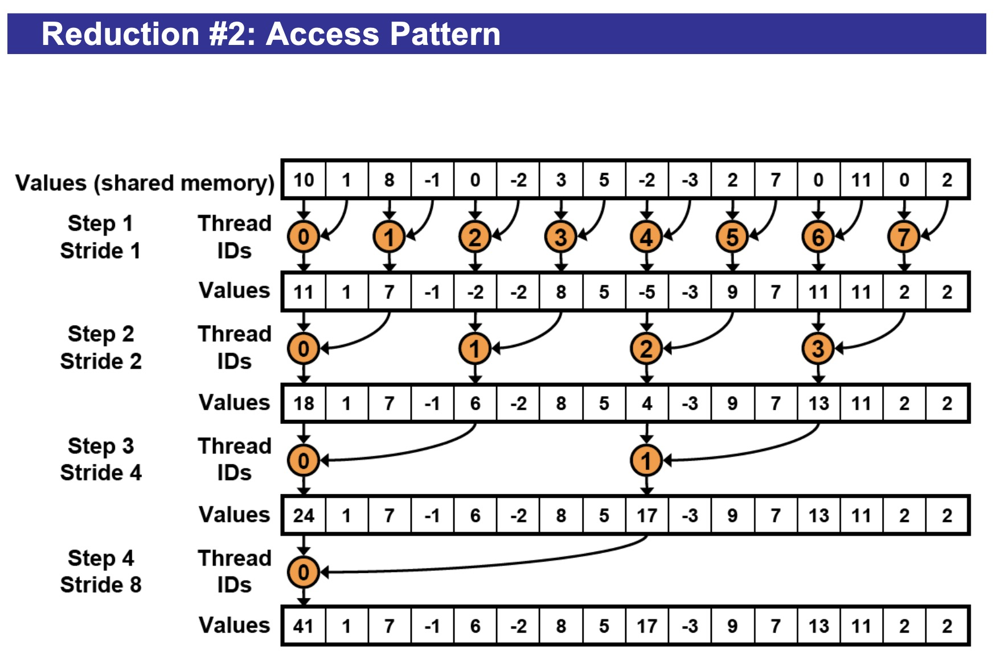
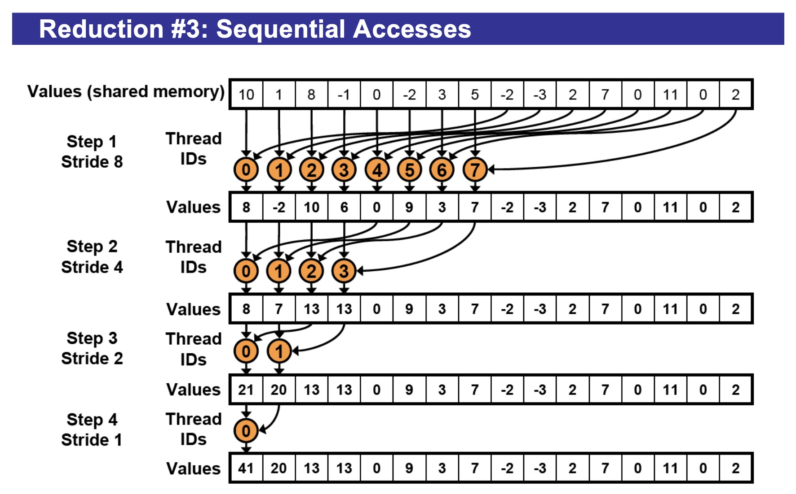

# Parallel Patterns

---

## Reductions

**Reduction** is a fundamental algorithmic pattern used to process a large array of input values and "reduce" them down to a single result.


---

## Implementation

### Step 1: Basic Implementation

```c++
__global__ void reduce0(int *g_idata, int *g_odata) {
  extern __shared__ int sdata[];
  // each thread loads one element from global to shared mem
  unsigned int tid = threadIdx.x;
  unsigned int i = blockIdx.x*blockDim.x + threadIdx.x;
  sdata[tid] = g_idata[i];
  __syncthreads();

	// do reduction in shared mem
  for (unsigned int s=1; s < blockDim.x; s *= 2) {
    // s: the distance between the thread and the data we are getting
    // step: the distance between the two participating thread
    // step = s*2
    // only threadIDs divisible by the step participate
    if (tid % (2*s) == 0) {
    	sdata[tid] += sdata[tid + s];
    }
  	__syncthreads();
  }
	
  // write result for this block to global mem
  // note: the memory is wrote in block chunk
	if (tid == 0) g_odata[blockIdx.x] = sdata[0];
}
```



---

**Problem:** the "if" statement results in divergent branching.

**Let's trace the first warp when `s=1` in implementation 1:**

| Thread ID | tid % 2 | Takes branch? |
| --------- | ------- | ------------- |
| 0         | 0       | ✅ YES         |
| 1         | 1       | ❌ NO          |
| 2         | 0       | ✅ YES         |
| 3         | 1       | ❌ NO          |
| 4         | 0       | ✅ YES         |
| ...       | ...     | ...           |
| 31        | 1       | ❌ NO          |

---

### Step 2: Non-divergent Implementation

**Key idea:** use consecutive threads for reduction.

```c++
__global__ void reduce0(int *g_idata, int *g_odata) {
  extern __shared__ int sdata[];
  // each thread loads one element from global to shared mem
  unsigned int tid = threadIdx.x;
  unsigned int i = blockIdx.x*blockDim.x + threadIdx.x;
  sdata[tid] = g_idata[i];
  __syncthreads();

  // do reduction in shared mem
  for (unsigned int s=1; s < blockDim.x; s *= 2) {
    // s: the distance between the thread and the data we are getting
    // step: the distance between the two participating thread
    // index: the position of the first value the thread is getting.
    
    int index = 2 * s * tid;
    if (index < blockDim.x / s) {
      sdata[index] += sdata[index + s];
    }
    __syncthreads();
  }
	
  // write result for this block to global mem
  // note: the memory is wrote in block chunk
	if (tid == 0) g_odata[blockIdx.x] = sdata[0];
}
```



---

**Explanation:** why implementation 2 is not divergent but implementation 1 is?

**Let's look at implementation 2.** Assume block has 128 threads.

Let's trace when `s=1`:

| Thread ID | index = 2*1*tid | index < 128? |
|-----------|-----------------|--------------|
| 0         | 0               | ✅ YES       |
| 1         | 2               | ✅ YES       |
| 2         | 4               | ✅ YES       |
| ...       | ...             | ✅ YES       |
| 31        | 62              | ✅ YES       |

**ALL** threads in warp 0 take the TRUE branch → **No divergence!**

**Warp 1 (threads 32-63):**
| Thread ID | index = 2*1*tid | index < 128? |
|-----------|-----------------|--------------|
| 32        | 64              | ✅ YES       |
| 33        | 66              | ✅ YES       |
| ...       | ...             | ✅ YES       |
| 63        | 126             | ✅ YES       |

**ALL** threads in warp 1 take the TRUE branch → **No divergence!**

**Warp 2 (threads 64-95):**
| Thread ID | index = 2*1*tid | index < 128? |
|-----------|-----------------|--------------|
| 64        | 128             | ❌ NO        |
| 65        | 130             | ❌ NO        |
| ...       | ...             | ❌ NO        |
| 95        | 190             | ❌ NO        |

**ALL** threads in warp 2 take the FALSE branch → **No divergence!**

---

**Problem:** two threads reading from the same bank causes bank conflicts.

Let's trace **Step 1** when `s=1`, with 8 threads (8 banks for visualization):

| Thread | Reads from | Banks accessed |
|--------|------------|----------------|
| 0      | sdata[0], sdata[1] | Bank 0, Bank 1 |
| 1      | sdata[2], sdata[3] | Bank 2, Bank 3 |
| 2      | sdata[4], sdata[5] | Bank 4, Bank 5 |
| 3      | sdata[6], sdata[7] | Bank 6, Bank 7 |
| 4      | sdata[8], sdata[9] | Bank 0, Bank 1 |
| 5      | sdata[10], sdata[11] | Bank 2, Bank 3 |
| 6      | sdata[12], sdata[13] | Bank 4, Bank 5 |
| 7      | sdata[14], sdata[15] | Bank 6, Bank 7 |

During the **first read** (`sdata[index]`):
- Thread 0 accesses Bank 0
- Thread 4 accesses Bank 0 ← **2-way conflict!**

During the **second read** (`sdata[index + 1]`):
- Thread 0 accesses Bank 1
- Thread 4 accesses Bank 1 ← **2-way conflict!**

---

### Step 3: Sequential Accesses

**Key idea:** each thread only access one bank.

```c++
__global__ void reduce0(int *g_idata, int *g_odata) {
  extern __shared__ int sdata[];
  // each thread loads one element from global to shared mem
  unsigned int tid = threadIdx.x;
  unsigned int i = blockIdx.x*blockDim.x + threadIdx.x;
  sdata[tid] = g_idata[i];
  __syncthreads();

  // do reduction in shared mem
  for (unsigned int s = blockDim.x/2; s > 0; s /= 2) {
    if (tid < s) {
      sdata[tid] += sdata[tid + s];
    }
    __syncthreads();
  }
	
  // write result for this block to global mem
  // note: the memory is wrote in block chunk
	if (tid == 0) g_odata[blockIdx.x] = sdata[0];
}
```

For the following example, assume bank size is 8



---

**Explanation:** why implementation 3 eliminates bank conflict?

Let's trace **Step 1** when `s=8`:

### What memory does each thread access?

Each thread performs: `sdata[tid] += sdata[tid + s]`

| Thread | Reads from | Banks accessed |
|--------|------------|----------------|
| 0      | sdata[0], sdata[8] | Bank 0, Bank 0 |
| 1      | sdata[1], sdata[9] | Bank 1, Bank 1 |
| 2      | sdata[2], sdata[10] | Bank 2, Bank 2 |
| 3      | sdata[3], sdata[11] | Bank 3, Bank 3 |
| 4      | sdata[4], sdata[12] | Bank 4, Bank 4 |
| 5      | sdata[5], sdata[13] | Bank 5, Bank 5 |
| 6      | sdata[6], sdata[14] | Bank 6, Bank 6 |
| 7      | sdata[7], sdata[15] | Bank 7, Bank 7 |

**No conflicts!** Each thread accesses its own unique bank.

---

### Step 4: First Step During Load

**Key idea:** each thread loads 2 elements instead of 1 from global memory, and performs calculation of step 1. 

```c++
__global__ void reduce0(int *g_idata, int *g_odata) {
  extern __shared__ int sdata[];
  // each thread loads 2 elements from global to shared mem
  // and performs the first step of the reduction
  unsigned int tid = threadIdx.x;
  unsigned int i = blockIdx.x* blockDim.x * 2 + threadIdx.x;
  sdata[tid] = g_idata[i] + g_idata[i + blockDim.x];
  __syncthreads();

  // do reduction in shared mem
  for (unsigned int s = blockDim.x/2; s > 0; s /= 2) {
    if (tid < s) {
      sdata[tid] += sdata[tid + s];
    }
    __syncthreads();
  }
	
  // write result for this block to global mem
  // note: the memory is wrote in block chunk
	if (tid == 0) g_odata[blockIdx.x] = sdata[0];
}
```

---

### Step 5: Unrolling the Last Warp

Once you're down to **32 or fewer active threads**, they all fit in **one warp**. And warps have a magical property:

**All 32 threads execute the exact same instruction at the exact same time.** This means they're **automatically synchronized** (no need for `__syncthreads()`)

```c++
__global__ void reduce0(int *g_idata, int *g_odata) {
  extern __shared__ int sdata[];
  // each thread loads 2 elements from global to shared mem
  // and performs the first step of the reduction
  unsigned int tid = threadIdx.x;
  unsigned int i = blockIdx.x* blockDim.x * 2 + threadIdx.x;
  sdata[tid] = g_idata[i] + g_idata[i + blockDim.x];
  __syncthreads();

  // normal loop until one warp left
  for (unsigned int s = blockDim.x/2; s > 32; s /= 2) {
      if (tid < s) {
          sdata[tid] += sdata[tid + s];
      }
      __syncthreads();
  }

  // last warp: manually unrolled
  if (tid < 32) {
      sdata[tid] += sdata[tid + 32]; // Threads 32-63 do useless work, who cares?
      sdata[tid] += sdata[tid + 16]; // Threads 16-31 do useless work, who cares?
      sdata[tid] += sdata[tid + 8];  // Threads 8-31 do useless work, who cares?
      sdata[tid] += sdata[tid + 4];
      sdata[tid] += sdata[tid + 2];
      sdata[tid] += sdata[tid + 1];
  }
	
  // write result for this block to global mem
  // note: the memory is wrote in block chunk
	if (tid == 0) g_odata[blockIdx.x] = sdata[0];
}
```

